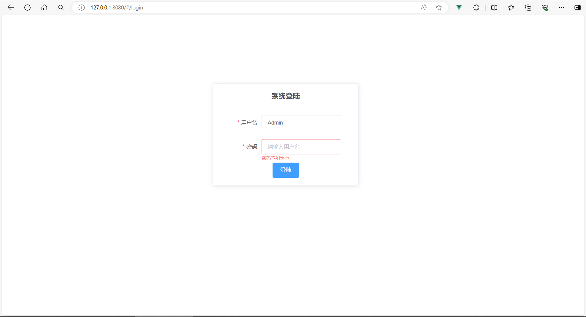
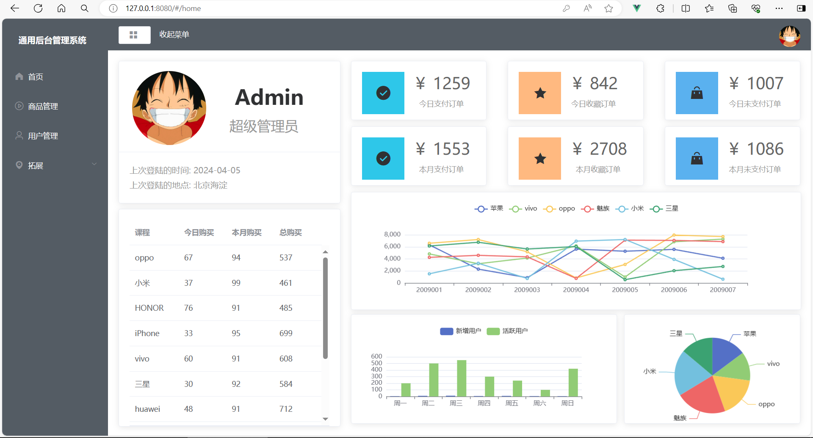
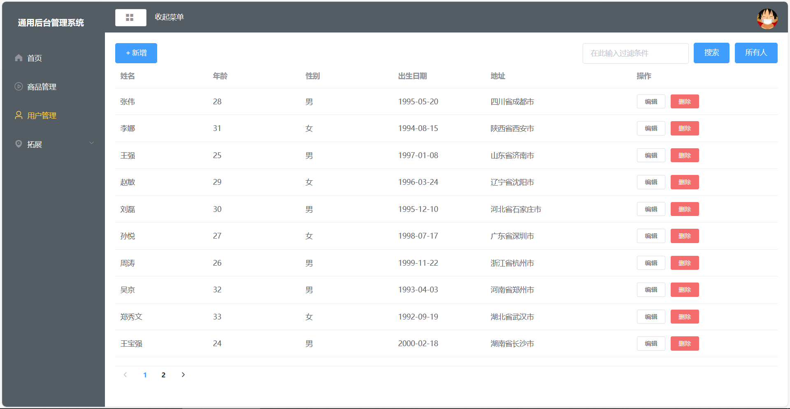

# 后台管理系统（基于Vue2实现）

# 1. 项目说明

​	本应用是基于vue2实现的后台管理系统，前端组件来自ElementUI，同时使用到了Vuex，后台数据通过mock和axios产生并获取。

# 2. 使用说明

- 生成版本使用：`node serve`（dist文件夹中为生产版本内容，serve文件夹中为服务端口）
- 开发版本使用：`npm run serve`

- 执行上述任意一条指令后即可登陆页面进行使用（登陆账号密码均为"Admin"）

# 3. 效果展示

**登陆界面**

**主界面**

**用户管理界面**

